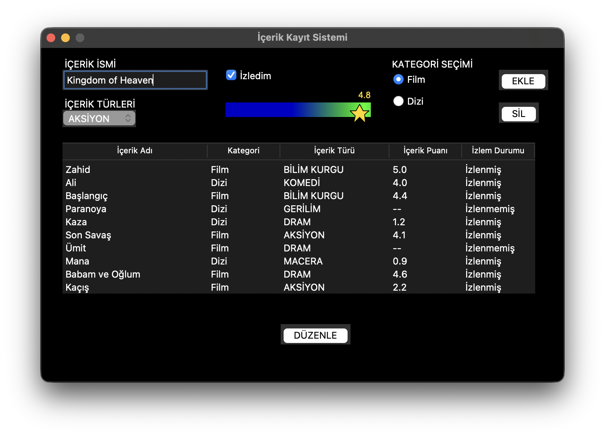

# 🎬 Movie & TV Show Tracking Application

A desktop application built with Python and Tkinter for tracking your movies and TV shows. Keep your watchlist organized with ratings, categories, and watch status.

## ✨ Features

- **Add Content**: Add movies and TV shows with details
- **Categories**: Classify as Movie or TV Show
- **Genres**: Comedy, Action, Drama, Adventure, Sci-Fi, Thriller, Horror
- **Star Rating**: Interactive slider rating system (0-5 stars)
- **Watch Status**: Mark content as watched or unwatched
- **Edit & Delete**: Modify or remove entries anytime
- **Persistent Storage**: All data saved in JSON format

## 🛠️ Technologies

- Python 3.x
- Tkinter (GUI)
- JSON (Data Storage)

## 📦 Installation

1. Clone the repository:
```bash
git clone https://github.com/YOUR_USERNAME/movie-tv-tracking-app.git
cd movie-tv-tracking-app
```

2. Run the application:
```bash
python "Film-Dizi Kayıt Uygulaması.py"
```

## 📸 Screenshot



## 📄 License

This project is open source and available under the [MIT License](LICENSE).

---

# 🎬 Film ve Dizi Takip Uygulaması

Python ve Tkinter ile geliştirilmiş, film ve dizilerinizi takip etmenizi sağlayan masaüstü uygulaması. İzleme listenizi puanlama, kategorilendirme ve izleme durumu ile organize edin.

## ✨ Özellikler

- **İçerik Ekleme**: Film ve dizileri detaylarıyla birlikte ekleyin
- **Kategoriler**: Film veya Dizi olarak sınıflandırın
- **Türler**: Komedi, Aksiyon, Dram, Macera, Bilim Kurgu, Gerilim, Korku
- **Yıldız Puanlama**: İnteraktif slider puan sistemi (0-5 yıldız)
- **İzleme Durumu**: İçeriği izlendi veya izlenmedi olarak işaretleyin
- **Düzenleme ve Silme**: Kayıtları istediğiniz zaman değiştirin veya silin
- **Kalıcı Depolama**: Tüm veriler JSON formatında saklanır

## 🛠️ Kullanılan Teknolojiler

- Python 3.x
- Tkinter (Grafiksel Arayüz)
- JSON (Veri Depolama)

## 📦 Kurulum

1. Depoyu klonlayın:
```bash
git clone https://github.com/YOUR_USERNAME/movie-tv-tracking-app.git
cd movie-tv-tracking-app
```

2. Uygulamayı çalıştırın:
```bash
python "Film-Dizi Kayıt Uygulaması.py"
```

## 📸 Ekran Görüntüsü


## 👥 Geliştiriciler

- Grup 13

## 📄 Lisans

Bu proje açık kaynaklıdır ve [MIT Lisansı](LICENSE) altında kullanılabilir.

